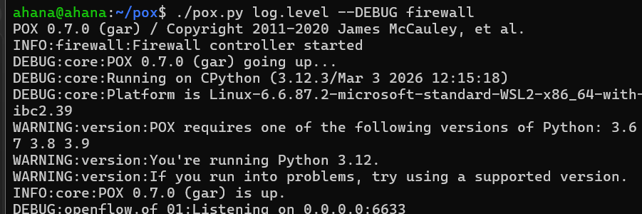
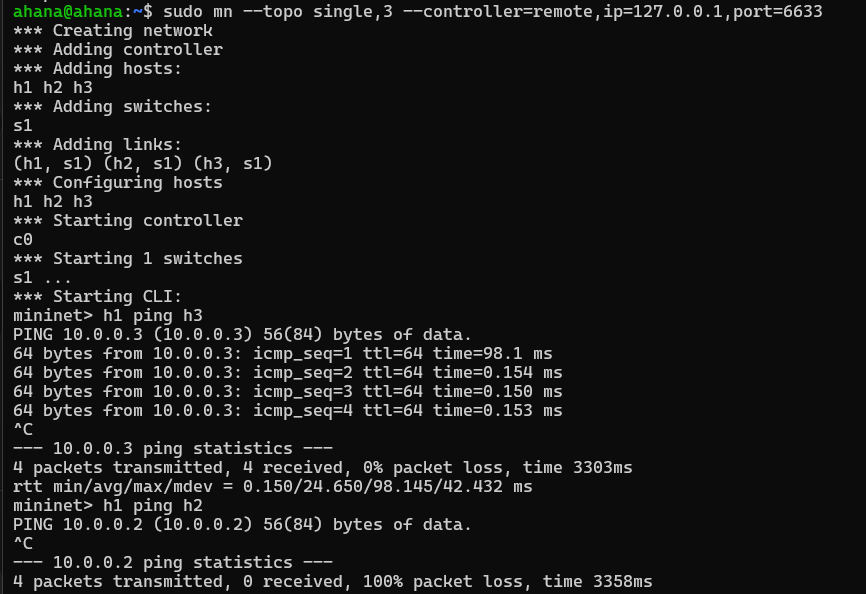
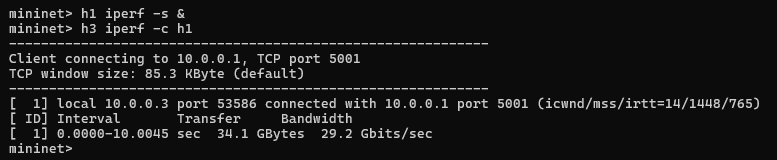
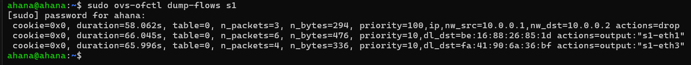
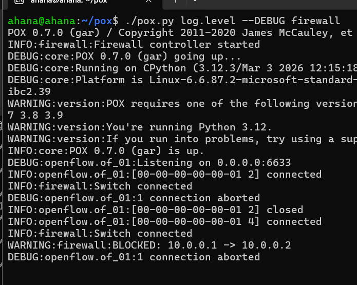

# SDN Firewall Using POX and Mininet

## Overview
This project implements a Software Defined Networking firewall using the POX controller, Mininet, and Open vSwitch. The controller acts as a learning switch for normal traffic, but it also enforces a specific IPv4 access-control rule that blocks communication from one host to another.

The main idea is simple: when a packet reaches the switch and no flow rule matches it, the switch sends the packet to the controller as a PacketIn event. The controller inspects the packet, decides whether it should be forwarded or dropped, and then installs a flow rule so later packets are handled directly by the switch.

## Project Goal
The goal of the project is to demonstrate how a centralized SDN controller can enforce a network policy without changing the hosts or the switch manually.

The implementation demonstrates:

- MAC learning at the controller
- IPv4-based filtering
- Dynamic OpenFlow rule installation
- Controller-side logging of blocked traffic
- Normal forwarding for allowed traffic
- Performance validation using ping and iperf

## Topology
The lab uses a single-switch, three-host topology.

| Host | IP Address |
| ---- | ---------- |
| h1   | 10.0.0.1   |
| h2   | 10.0.0.2   |
| h3   | 10.0.0.3   |

### Why this topology
A single switch keeps the experiment focused on firewall behavior instead of routing. It makes the controller logic easier to observe, and it clearly separates blocked traffic from allowed traffic in a small, repeatable test environment.

## Firewall Policy
The policy enforced by the controller is:

- Block: 10.0.0.1 -> 10.0.0.2
- Allow: all other traffic

This means the controller only filters one IPv4 pair. ARP traffic and other non-blocked packets are still permitted so that normal host communication can proceed.

## Controller Design
The controller is implemented in [firewall.py](firewall.py). It follows two responsibilities at the same time:

1. Learn the location of hosts by storing MAC-to-port mappings.
2. Enforce the firewall rule before installing forwarding entries.

### PacketIn handling
PacketIn is the main event that drives the controller logic.

When the switch receives a packet that does not match an existing flow entry, it forwards that packet to the controller. The controller then:

1. Reads the parsed Ethernet frame from the event.
2. Extracts the source MAC address and remembers which switch port it arrived on.
3. Checks whether the frame contains an IPv4 payload.
4. If the packet is IPv4, compares the source and destination IP addresses against the firewall policy.
5. If the packet matches the blocked pair, installs a drop rule with higher priority and logs the event.
6. If the packet is allowed, chooses the output port using the learned MAC table and installs a forwarding rule.
7. Sends the current packet out through the selected port.

### ARP and non-IP traffic
The firewall only blocks IPv4 traffic. ARP packets are still processed normally because they are required for address resolution before IP communication can happen. If ARP were blocked, the network would not be able to learn MAC addresses correctly.

### Learning-switch behavior
For permitted traffic, the controller behaves like a basic learning switch:

- The source MAC address is learned on the ingress port
- The destination MAC address is looked up in the table
- Known destinations are forwarded to the correct port
- Unknown destinations are flooded

This keeps the network working normally for allowed traffic while still enforcing the block rule.

## Flow Rule Logic
Two classes of rules are installed in the switch.

### Firewall rule

- Priority: 100
- Match: IPv4 traffic from 10.0.0.1 to 10.0.0.2
- Action: drop

### Forwarding rule

- Priority: 10
- Match: destination MAC address
- Action: output to the learned switch port

The high-priority firewall rule prevents the blocked flow from being forwarded by any lower-priority learning rule.

## Installation

### 1. Install dependencies

```bash
sudo apt update
sudo apt install mininet openvswitch-switch git -y
```

### 2. Get POX

If POX is not already available, clone it locally:

```bash
git clone https://github.com/noxrepo/pox.git
```

Place the firewall module in the POX root directory or make sure POX can import it when launched.

## How to Run

### 1. Start the controller

From the POX directory:

```bash
./pox.py log.level --DEBUG firewall
```

This starts the controller, loads the firewall module, and begins listening for OpenFlow connections on port 6633.



### 2. Start Mininet

Open a second terminal and run:

```bash
sudo mn -c
sudo mn --topo single,3 --controller=remote,ip=127.0.0.1,port=6633
```

This creates:

- 3 hosts: h1, h2, h3
- 1 switch: s1
- One remote controller connection to POX



## Testing and Validation

### Expected behavior during testing
The firewall should show the following behavior during validation:

- h1 to h2 is blocked
- h1 to h3 is allowed
- ARP still works normally
- The controller prints a blocked-traffic log message
- The switch flow table shows the drop rule and learned forwarding entries

### Allowed traffic test

Run:

```bash
mininet> h1 ping h3
```

Expected result:

- Ping succeeds
- Packet loss is zero after the first rule installation
- The controller only handles the first packet of the flow


### Blocked traffic test

Run:

```bash
mininet> h1 ping h2
```

Expected result:

- Ping fails
- The packets from 10.0.0.1 to 10.0.0.2 are dropped
- The controller logs the blocked IPv4 flow


### Throughput test

Run:

```bash
mininet> h1 iperf -s &
mininet> h3 iperf -c h1
```

Expected result:

- Traffic between allowed hosts reaches the server normally
- The switch forwards later packets directly after the rule is installed
- The controller does not stay in the data path for every packet



### Flow table inspection

Check the switch rules with:

```bash
sudo ovs-ofctl dump-flows s1
```

Expected result:

- One high-priority drop rule for the blocked IPv4 pair
- Lower-priority forwarding rules for allowed traffic
- MAC-based forwarding entries learned by the controller



### Controller log verification

When restricted traffic is detected, the controller prints a message like:

```text
BLOCKED: 10.0.0.1 -> 10.0.0.2
```

This confirms that the controller inspected the packet and enforced the firewall policy before forwarding it.



## What Each Screenshot Shows

- screenshots/1.png: POX controller startup and OpenFlow listener initialization
- screenshots/2.png: Mininet topology startup plus ping validation for allowed and blocked traffic
- screenshots/3.png: iperf throughput test for permitted traffic
- screenshots/4.png: OVS flow table showing learned forwarding and firewall rules
- screenshots/5.png: Controller log message showing a blocked IPv4 flow

## Performance Observation
The first packet of a new flow is sent to the controller. After the controller installs the correct flow rule, the switch handles later packets directly. This reduces controller overhead and keeps allowed traffic efficient.

In practice, this means:

- Initial packets may take slightly longer because they trigger PacketIn handling
- Later packets are forwarded by the switch without controller involvement
- The blocked flow is dropped immediately after the firewall rule is installed

## Troubleshooting

### POX warns about Python version
The POX console may warn that it prefers Python 3.6 to 3.9 while the environment is running Python 3.12. In this project, the controller still runs and the firewall behavior works, but using a supported Python version is safer if you encounter instability.

### Mininet cannot connect to the controller
Check that POX is running before starting Mininet and that it is listening on port 6633.

### Old network state causes problems
If Mininet behaves unexpectedly, clean up the environment first:

```bash
sudo mn -c
```

### No blocked log appears
Make sure you are testing the correct flow, which is 10.0.0.1 to 10.0.0.2.

## Project Structure

```text
firewall/
├── firewall.py
├── README.md
└── screenshots/
    ├── 1.png
    ├── 2.png
    ├── 3.png
    ├── 4.png
    └── 5.png
```

## Conclusion
This project demonstrates how SDN can be used to implement a simple but effective firewall. The controller learns host locations, blocks a specific IPv4 communication pair, and installs OpenFlow rules dynamically so the switch can process later packets efficiently.

The result is a compact example of centralized network policy enforcement using POX and Mininet.
